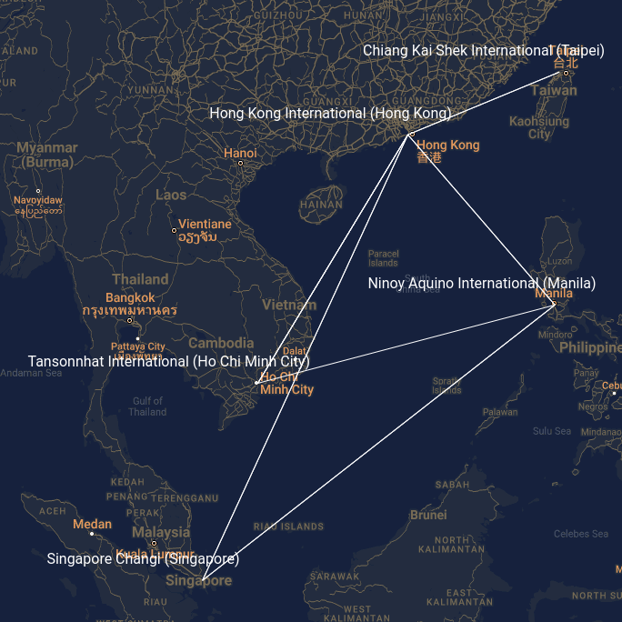

# flight-pack

A demo app using wasm-pack-plugin, drawing flight information on Google Map.

[View Demo](https://tokyo800.jp/mina/flight/)  

## 1. About

This is a demo WASM app using
[wasm-pack-plugin](https://github.com/wasm-tool/wasm-pack-plugin)
to draw airplane flight paths on Google map.
The app aims to provide developers an example using
[wasm-pack-plugin](https://github.com/wasm-tool/wasm-pack-plugin)
to create WASM apps in Rust, intends to help in solving common issues.

Follows a brief description of what the app does:

1. JS runs the WASM app, passing a list of airports for which we want arrivals/departures.
1. WASM app fetches arrival/departure information from [FlightAware's Aero API](https://flightaware.com/commercial/aeroapi/).
1. WASM app returns a list of geo-coordinates for which JS can update the map bounds for Google Map.
1. WASM app runs a loop, constantly draws flight paths on a canvas region over the Google Map.

But, wait. Unfortunately,
[FlightAware's API does not allow client apps to fetch data](https://flightaware.com/commercial/aeroapi/faq.rvt#cors).
As such, this app internally has dummy arrival/departure data,
and retrieves the data instead of fetching remotely.
Yet, I believe it still serves the purpose
of demonstrating how you can manage JSON data in WASM apps.
We encounter tons of problems when writing WASM apps,
such as when we spawn threads per JS request,
or when we handle DOMs using
[wasm-bindgen](https://rustwasm.github.io/wasm-bindgen/)
and
[web-sys](https://rustwasm.github.io/wasm-bindgen/api/web_sys/), etc.
Well, I found it hard figuring out for solutions, and I bet you would, too.
The app may not give you exact answers to your specific problems,
but it should at least give suggestions for possible solutions.

### Key Features

Since the app is provided for learning purpose,
there are several features that I implemented intentionally
so that you may find them useful when you deal with those.

- __Keeps Original Structure__  
Tried as much as possible to preserve the default directory structure provided by `wasm-pack-plugin`. It would be hard for developers to see changes if the project was heavily customized without any traces of what they were like before.
- __Serialize/Deserialize JSON Data__  
Serializing/Deserializing JSON structures to communicate with JS is where many developers struggle when developing WASM apps. Also, this app retrieves internally stored dummy JSON data, and that should give you better ideas.
- __Threads__  
When using [wasm-bindgen](https://rustwasm.github.io/wasm-bindgen/), you may not avoid dealing with threads. This app provides several ways passing data over threads, especially, when you want _asynchronous_ tasks in there.
- __Borrowing/Cloning/Mutating__  
As you can imagine, we deal with a lot of _borrowing_ when writing in Rust. This app includes examples using some of the commonly used basic types such as `Arc`, `Rc`, `RefCell` along with in-depth comments explaining why they were done the way they were done.

### How the App Works

Here, sketches an outline of how the app works:

1. [JS](https://github.com/minagawah/flight-pack/blob/main/js/index.js#L64) kicks off by creating an instance of `App` which is an exposed struct for JS to use: `app = new wasm.App(el.canvas)`
1. [JS](https://github.com/minagawah/flight-pack/blob/main/js/index.js#L71) calls `await app.prepare(airports)`
1. `airports` is in [JSON format](json/airports.json) given from JS, and it is a list of airports for which JS wants WASM app to fetch arrival/departure information from FlightAware API.
1. `App::prepare(airpots)` runs, but it does nothing... Instead, [it bypasses the call:](https://github.com/minagawah/flight-pack/blob/main/src/app.rs#L89) `Proxy::prepare(this, airports).await`
1. Looking into `Proxy`, it exposes _static functions_ only. `App` has `proxy: Arc<Proxy>` in its data. Whenever `App` wants `Proxy` to perform some tasks, `App` passes this `proxy` to these functions. `proxy` is the _context_ in executing these functions, and these static functions can access their own resources using `proxy`.
1. When running `Proxy::prepare(this, airports).await`, [it calls](https://github.com/minagawah/flight-pack/blob/main/src/proxy.rs#L102) `Manager::prepare(canvas.ctx, airports)`.
1. There, [it will deserialize](https://github.com/minagawah/flight-pack/blob/main/src/manager.rs#L79) `airport` (originally JSON), and sets for its own.
1. For `airports`, `Manager` [fetches arrival/departure information](https://github.com/minagawah/flight-pack/blob/main/src/manager.rs#L81) from FlightAware's Aero API (which, it actually retrieves internally stored dummy data).
1. Once fetched, [it will extract geo-coordinates from the arrivals/departures](https://github.com/minagawah/flight-pack/blob/main/src/manager.rs#L83), and return the list back to JS as a _Promise_.
1. Having [the geo-coordinates returned from WASM app](https://github.com/minagawah/flight-pack/blob/main/js/index.js#L72), JS will use `setBounds` (of Google Map API) to update the map with a new bounds.
1. Now, JS [runs](https://github.com/minagawah/flight-pack/blob/main/js/index.js#L80) `app.start()`. When that happens, `App::start()` is called, and `Proxy::run` is called. In there, [it will start the animation loop](https://github.com/minagawah/flight-pack/blob/main/src/proxy.rs#L117).
1. Whenever browser size changes, JS will [call](https://github.com/minagawah/flight-pack/blob/main/js/index.js#L89) `app.update(map.getBounds().toJSON())`.
1. Runs `App::update()`, basically, is about running `Proxy::set_bounds()`.

### Note on 'App' and 'Proxy'

`App` does not do much. Instead, `Proxy` does all the jobs for `App`.
When we want to call asynchronous functions
(in WASM apps using
[wasm-bindgen](https://rustwasm.github.io/wasm-bindgen/)),
we spawn a thread.
However, say, you want move `self` of `App` into the thread.
Unfortunately, Rust does not allow that...
To move it into the thread, you need to clone `self`.
Yet, again, that will cost too much...
That's why we have `proxy: Arc<Proxy>` which is the only variable defined in `App`.
Cloning `Arc` costs you nothing because it means
to just prepare another reference to the original.
Notice `Proxy` exposes static functions only.
Whenever you want some jobs done using `Proxy`,
you simply clone `proxy` instance (which will be just a reference) in `App`,
and you pass it to these static functions
(we refer to it as `this` because it sounds perfect for the name).
When receiving `this`, the static functions will use it for their own contexts,
looking up their own resources.
In another word, static functions begin to behave just like
any other member functions.
It is just that `App` holding onto the context.

## 2. What I Did

See [the diff](docs/diff.md) for what I did to the project.
It should add more specificity to your understanding.

## 3. License

Dual-licensed under either of the followings.  
Choose at your option.

- The UNLICENSE ([LICENSE.UNLICENSE](LICENSE.UNLICENSE))
- MIT license ([LICENSE.MIT](LICENSE.MIT))

This demo app contains arrival/departure information fetched from
[FlightAware Aero API](https://flightaware.com/commercial/aeroapi/),
and are stored in [json/arrivals_*.json](./json).

- Terms of Use - FlightAware  
https://flightaware.com/about/termsofuse

The app also contains [json/airports.json](json/airports.json) which is a list of airports around the world, and was downloaded from
[Arash Partow's website](https://www.partow.net) which is licensed under MIT:

- The Global Airport Database  
  Free use of The Global Airport Database is permitted under the guidelines and in accordance with the MIT License.  
  https://www.partow.net/miscellaneous/airportdatabase/index.html
